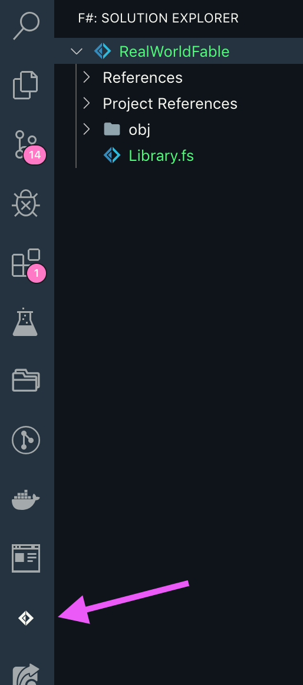

---
title: Hello World in F# with Fable
path: /realworld-fable/02-hello-world-fsharp-fable
order: 2
series: RealWorld Fable
--- 
Now that you have everything you need installed let's begin scaffolding our RealWorld app. At the end of this step, you should have a running application where you'll finally be saying Hello 👋 to the World 🌎!

First of all, create a new folder that will be the root of your app, I named mine `real-world-fable`.

Get into that folder and let's create a new .NET core project. When you install .NET core you get a [CLI tool](https://docs.microsoft.com/en-us/dotnet/core/tools/?tabs=netcore2x) that is capable of doing many different things, one of those is creating a new project. Just run the following command:

```
dotnet new classlib -lang F# -n RealWorldFable -o src
```

This command will create a new `src` folder and an F# project named RealWorldFable inside of it. This project is of classlib type, understanding what a .NET project type is, is not relevant in this case but you can [learn more about it here](https://docs.microsoft.com/en-us/dotnet/core/tools/dotnet-new?tabs=netcore22#arguments).

Open your editor on the root folder. If you're using VSCode with Ionide you should see in your Activity Bar an icon for F# as you can see in the following image and the F# Explorer should be opened by default, but if it's not, just click on it. 



**If you're not using VSCode worry not, I'll explain how to achieve the same results without using it.**

Select the Library1.fs file and delete it, next, right-click the name of the project (at the top) and select "Add File" give it the name App.fs.

**For non VSCode users only:** you can do the same as mentioned above, and then you need to open the `src/RealWorldFable.fsproj` file, look for Library.fs in that file and replace it with App.fs.

Let's leave that App.fs file for now and set up the node part of things. From the terminal, at the root level of the project type in:

```
npm init -y
```

If you're not familiar with that command, it will create the necessary things (a package.json file) for a node project. We'll modify that package.json file soon, but first, let's start installing a few dependencies.

Wait what? Yes, since this app, in the end, will be compiling to JavaScript, our F# code will be interacting with JavaScript, also we'll need some tools to help us build the application. Remember, Fable is the combination of F# and [Babel](https://babeljs.io/).

Also, in the end, this application will be running on top of [React](https://reactjs.org/), although you won't need to know any React for that, that also means we need to have to install React.

### Installing JS dependencies

Here are the commands you'll need to run to install the required dependencies.

```
npm i react react-dom
```

and

```
npm i -D @babel/core fable-compiler fable-loader webpack webpack-cli webpack-dev-server
```

I know, I know, those are a lot of dependencies and that's just for the JavaScript side 🤷. We still need to add some dependencies on the F# side, but that will be in just a moment. Most of the installed dependencies are needed only for development. So far, only React is being added as a production dependency.

### Webpack configuration

Let's move on to Webpack, and Webpack is a bundler/builder that will help us in the process of building our solution. I won't discuss how Webpack works here, I will just share the needed code for you to make it work. If you want to know more [visit its web site's documentation](https://webpack.js.org/).

At the root folder add a file named webpack.config.js then add the following to this file:

```js
var path = require("path");

module.exports = {
    mode: "development",
    entry: "./src/RealWorldFable.fsproj",
    output: {
        path: path.join(__dirname, "./public"),
        filename: "bundle.js",
    },
    devServer: {
        contentBase: "./public",
        port: 8080,
    },
    module: {
        rules: [{
            test: /\.fs(x|proj)?$/,
            use: "fable-loader"
        }]
    }
}
```

This is a very simplified Webpack configuration, it has the minimum needed for the app to run in development mode, here's what you need to know about.

1) Webpack is looking for a file src/RealWorldFable.fsproj, that's our F# file that will have all information related to the F# project.
2) The fable-loader is being used to process the F# files.

Webpack is a very feature-rich tool and waaaay more complex than we have time to explore here, at some point you'll need more from it, but that's for another time.

### The index shell file

Let's add a new file public/index.html file, and inside of it add the following:

```html
<!DOCTYPE html>
<html>
  <head>
    <title>Conduit</title>
    <meta charset="utf-8" />
    <!-- Import Ionicon icons & Google Fonts our Bootstrap theme relies on -->
    <link
      href="//code.ionicframework.com/ionicons/2.0.1/css/ionicons.min.css"
      rel="stylesheet"
      type="text/css"
    />
    <link
      href="//fonts.googleapis.com/css?family=Titillium+Web:700|Source+Serif+Pro:400,700|Merriweather+Sans:400,700|Source+Sans+Pro:400,300,600,700,300italic,400italic,600italic,700italic"
      rel="stylesheet"
      type="text/css"
    />
    <!-- Import the custom Bootstrap 4 theme from our hosted CDN -->
    <link rel="stylesheet" href="//demo.productionready.io/main.css" />
  </head>

  <body>
    <div id="real-world-fable-app"></div>
    <footer>
      <div class="container">
        <a href="/" class="logo-font">conduit</a>
        <span class="attribution">
          An interactive learning project from
          <a href="https://thinkster.io">Thinkster</a>. Code &amp; design
          licensed under MIT.
        </span>
      </div>
    </footer>
    <script src="bundle.js"></script>
  </body>
</html>
```

This is pretty standard HTML and most of it came from the [RealWorld examples app instructions](https://github.com/gothinkster/realworld-starter-kit/blob/master/FRONTEND_INSTRUCTIONS.md#header). It's a way to keep the visuals standard. 

There are two special things we added:

1) The `div` with an id of `real-world-fable-app`. Our app will be injected inside of that div.
2) The script tag pointing to the bundle.js file that will be generated by Webpack.

### Installing the F# dependencies

To install the dependencies we need, we'll be reaching once again to the dotnet cli. Open a terminal and from the root folder enter:

```
dotnet add src/RealWorldFable.fsproj package Fable.Core
dotnet add src/RealWorldFable.fsproj package Fable.Elmish
dotnet add src/RealWorldFable.fsproj package Fable.Elmish.React
dotnet add src/RealWorldFable.fsproj package Fable.Elmish.Browser
dotnet add src/RealWorldFable.fsproj package Fable.Elmish.Debugger
dotnet add src/RealWorldFable.fsproj package Fable.Elmish.HMR
dotnet add src/RealWorldFable.fsproj package Fable.React
```

Unfortunately as of the time of this writing, there's no support from the CLI to install multiple packages with a single command, but you can copy and paste all lines and that should work.

Great! We're almost finished, just a couple more steps to go.

### Your first F# lines of code

Inside of the `src/App.fs` enter the following lines, and don't worry if they don't make any sense right, in the next lesson we'll be exploring them.


```fsharp
module App

open Fable.React

type Model = string

type Msg = Msg

let init() = "Hello World from Fable and F#"

let update msg model = model

let rootView model dispatch = div [] [ str model ]

open Elmish
open Elmish.HMR

Program.mkSimple init update rootView
|> Program.withReactSynchronous "real-world-fable-app"
|> Program.withConsoleTrace
|> Program.run
```

### Starting up the app

Now the final step, let's update the `package.json` file so we can easily start the app.

Open the file and find the `scripts` section and replace whatever is in there with this:

```json
"scripts": {
    "start": "webpack-dev-server"
}
```

Get back to console and enter `npm start` next, open a new browser tab and navigate to `http://localhost:8080`, you should see your "Hello World".

Try updating the text inside of the `src/App.fs` file, save it and it will automatically update in the browser.

That's it! You are now up and running. 🚀

I know that looks like a lot, but to be honest, you won't need to do this every time, in fact, there's a [Fable minimal project sample](https://github.com/fable-compiler/fable2-samples/tree/master/minimal) that you could have cloned and started working from it. It's not exactly the same but will achieve the same results.

The point was to understand what's going on. 📖

Next, we will explore what's going on in that `src/App.js` file with the basics of how F# works and also Elmish. Elmish?!!?? What about Fable? We'll get into that as well.