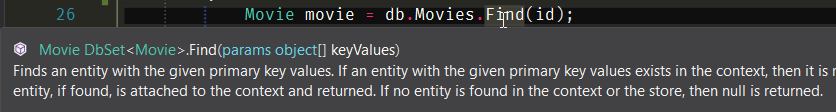

<script context="module">
export { default as cover} from "./banner.png"
</script>

Working with the possibility of null in any language that allows it, sucks. It's
tedious, and there's boilerplate code involved, it's not fun and error prone.

Luckily for those who write C#, there's a very nice library called
[language-ext](https://github.com/louthy/language-ext) that among other things
can help handling nulls in C#.

## The Problem

Really? Do I need to talk about the problem with nulls in C#?


I guess everyone that has worked professionally with C# has already faced that
kind of error. Many times in production, because someone forgot to handle it
correctly.

## The Design Fix

First, the easy part. _Don't return or pass null in your code, EVER!_

If you're returning null, you're creating a source of bugs, and you are
miscommunicating the intention of your function/method.

Second, if for any reason you are doing this:

```csharp
var obj = new MyClass();
obj.SomeMethod(1, "das", null);
```

You're clearly doing it wrong. If an argument is optional, you can create a
method overload (as one simple solution).

Bottom line is: _don't return or pass null in your code, EVER!_

In your code, you might feel tempted to return a null value, because you can't
return anything else or you think you can't return anything else which is not
true, you can always use the
[Null Object Pattern](https://dotnetcodr.com/2013/05/06/design-patterns-and-practices-in-net-the-null-object-pattern/),
after all, C# is an object-oriented language.

## The not so simple solution

But life is not that simple, and most of the times we are interacting with third
party libraries or legacy code that we can't or won't change for whatever
reason, and that code or libraries may return null values.

This is one situation where the language-ext library can help and a lot.

So let's see a real life scenario, like for instance if we were using the Entity
Framework library to fetch some data.

In the following example, I have an action method from an MVC controller that is
trying to fetch a movie from the database.

```csharp
public ActionResult Details(int id)
{
    Movie movie = db.Movies.Find(id);
    if (movie == null)
    {
        return HttpNotFound();
    }
    return View(movie);
}
```

And what is the problem with that code?

Well, first we have to check if the movie object is null, and if it is, return a
not found. And the problem is, by the signature of the method alone you can't
tell.



But go ahead and read the last phrase of the documentation in the above image.
See, there's some documentation to tell you that it may return a null value.
Wouldn't it be better if the compiler told us that?

With language-ext is very simple. First, to use it, all you have to do is add a
[nuget package](https://www.nuget.org/packages/LanguageExt.Core) to your
project.

Next, you can declare a variable of type `Option<T>`.

```csharp
Option<Movie> movie = db.Movies.Find(id);
```

The `Option<T>` has an implicit conversion from the null or the T type. So if the
Find method returns null, it will be converted to an especial derivation of
`Option<Movie>` a None.

An `Option<T>` will either contain a value of the type T (in this case a movie
instance), or it will contain an especial type known as None.

And how None is better than null you might ask? Well, that will get clear once
we start seeing how we interact with an instance of `Option<T>`.

The first thing you notice when working with an Option is that you _can't_
access its inner value, there's no property `Option<Movie>.Value` or method
`Option<T>.GetValue()`.

Let's say you want to print the title of the movie in the console if the movie
is found and a message indicating that no movie was found otherwise.

Here's how you can do that:

```csharp
Option<Movie> movie = db.Movies.Find(id);
movie.Match(
    m => Console.WriteLine(m.Title),
    () => Console.WriteLine("No movie was found")
);
```

To interact with a movie value, one of the options is to call the Match method.
The match method expects two arguments one action to handle the case where
there's a movie value and another case where there's no movie (a.k.a. a None).

Another way to handle that is by calling the methods Some or None. Like so:

```csharp
Option<Movie> movie = db.Movies.Find(id);
movie
    .Some(m => Console.WriteLine(m.Title))
    .None(() => Console.WriteLine("No movie found"));
);
```

In this case, you might think that you can call only the Some method and only
handle one case, but language-ext is smart enough and it will only execute after
you call the None method and the None method is only available after calling the
Some method.

**Why is that good?**

That's good because we are using the compiler to our advantage. The application
will only compile if the program provides a way to handle both cases. No more
hidden bugs and unhandled edge cases. That's why we use a static compiled
language in the first place, isn't it?

Let's see another example, let's say that after searching for a movie, I want
only to return its title capitalized or a no movie found message. Well, to
convert a value (a Movie) into another one (a string) we use the Map method,
which works in the same way as the Match method.

```csharp
Option<Movie> movie = db.Movies.Find(id);
Console.WriteLine(movie.Map(m => m.Title.ToUpper(), () => "No movie found"));
```

Again, we have to pass two arguments to the Map method, one for each case. And
if we don't it won't compile.

Sure, there are times when we don't have a case for handling the nulls, meaning
there's nothing to do with it. For that case, there's the IfSome method.

```csharp
Option<Movie> movie = db.Movies.Find(id);
movie.IfSome(m => Console.WriteLine(m.Title));
```

The difference, in this case, is that you know for sure that if that inline
function is called, it means that the `Option<T>` has a value. One more time,
using the compiler to our advantage.

**The None value**

So yeah, the None value is mostly a derivation of the `Option<T>` one that
indicates that the Option doesn't have a value. It is used mostly internally by
the Option to decide if it can execute a branch or another of the code. But you
can check it the Option is a Some or a None

```csharp
Option<Movie> movie = db.Movies.Find(id);
if(movie.IsSome)
{
    //
}

if(movie.IsNone)
{
    //
}
```

## A better version of the above example

At the top I showed an example of an MVC action, so how would I rewrite it? On
version and I'm pretty sure that by now you would be able to do, is this one:

```csharp
public ActionResult Details(int id)
{
    Option<Movie> movie = db.Movies.Find(id);

    return movie
        .Match<ActionResult>(
            movie => View(movie),
            () => HttpNotFound());
}
```

But this is so common that I'd suggest you write a small method extension,
something like this:

```csharp
public static class DbSetExtensions
{
    public static Option<T> FindOptional<T>(this DbSet<T> src, int id)
        where T : class
    {
        return src.Find(id);
    }
}

public class MovieController
{
    public ActionResult Details(int id)
    {
        return db.Movies.FindOptional(id)
            .Match<ActionResult>(
                movie => View(movie),
                () => HttpNotFound());
    }
}
```

## Improving the design

So, I started justifying the use of language-ext's Option when dealing with
third party libraries or legacy code. But to be honest, all new code can benefit
from a better design using the `Option<T>` type.

Let's say you want to use the Repository pattern. When you're creating methods
such as GetById or Find as we've seen, you can always return an `Option<T>`

```csharp
class MovieRepository
{
    public Option<Movie> GetById(int id)
    {
        //
    }
}
```

This way, the users of you're class will always have to handle both cases, and,
you'll never return null values because the null will be converted to an
`Option<Movie>.None`. But the most important benefit is that your code will
transmit the correct message just by reading the signature of the method.

You know that, just by reading _`public Option<Movie> GetById(int id)`_ that this
method might return a Movie, but there's a chance that it might not.

## Conclusion

Nulls are some of the most boring problems to handle in programming and one big
source of bugs. This is definitely a better way to deal with it. The
[language-ext](https://github.com/louthy/language-ext) has other very
interesting features worth exploring, the `Option<T>`
[monad](http://bit.ly/2jB32bG) (yes I said it, it's a monad) is just one of
them. I recommend checking it out.
