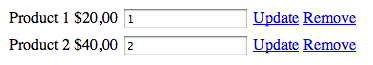

Many people who complain about JavaScript does not take the minimum effort to
understand the language and for most of the time, the code developed is not
treated as a real code, after all, "it's just JavaScript".

But this is just one of the reasons of the many problems we face when we have to
maintain an existing code. The good old spaghetti code.


I have to confess that I've contributed to a lot of code spaghetti (like the
example I'm showing here). Exactly because I have not treated it as a serious
program and have not applied basic principles such as
[single responsibility](http://www.oodesign.com/single-responsibility-principle.html).

Let's imagine a shopping cart such as the one from the image below, which has a
link to update the quantity of items from the cart. The code I'm showing
captures the click on the link using jQuery and validates the value entered in
the field to make sure it is numeric. The business rules say that it has to be a
number between 0 and 10. We cannot sell more than 10 units of the same item.



A code that would do that is this:

```js
$(document).ready(function () {
	$(".update_cart").click(function (e) {
		e.preventDefault();
		var itemsCount = $(this).closest("td").prev().children(".quantity").val();
		if (isNaN(itemsCount) || parseInt(itemsCount, 10) < 0 || parseInt(itemsCount, 10) > 10) {
			showError("Not a valid number");
			return;
		}
		$.ajax({
			url: "/updatecart",
			data: {
				// get the data from the form
			},
			success: function (data) {
				// update table with cart data
			},
			error: function (xhr, status, error) {
				// handle error
			}
		});
	});
});
```

While this is a simple code - which is slightly shorter than it would be now
that I omitted some details of implementation - it violates one of the most
important principles of development in my opinion that is, the single
responsibility principle. But, it is the kind of code that we can quite easily
see in many web applications.

Because we don't have classes in JavaScript, functions are what is used for
making separations of responsibilities. See, in the example above, the function
responsible for handling the update click event, validates the data, makes an
Ajax request and also refreshes the page after the result, whether successful or
not.

Making a brief analogy, the Ajax request like the one above, could be compared
to a web service request made​from a C# or Java program. That is, a request to
an external service, or better yet, this is an external dependency that is
generating high coupling code. Here's the first separation we can do.

Another point, the above script reads information from the page (the DOM) and
then updates information on the same page. So, in another analogy, one can say
that the DOM in this case, is a form of database, therefore, is another external
dependency that we can separate from the code.

So let's see what would be a better code for this case.

```js
$(document).ready(function() {

  function BasketUpdater (basketView, basketService) {
    this.init = function() {
      basketView.handleUpdate(this.update);
    }

    this.isValid = function(item) {
      var quantity = item.quantity;
      return !isNaN(itemsCount) &&
        parseInt(itemsCount, 10) >= 0 && parseInt(itemsCount, 10) <= 10
    }

    this.update = function(item) {
      if(this.isValid(item)) {
        basketService.update(item,
          basketView.refreshViewSuccess, basketView.refreshViewError)
      }
    }
  }

  function BasketView() {
    this.handleUpdate = function(callback) {
      $(".update_cart").click(function(e) {
        e.preventDefault();
        // generate an item object with the data
        callback(item);
      }
    }

    this.refreshViewSuccess = function() {
      //
    }

    this.refreshViewError = function() {
      //
    }
  }

  function BasketService(url) {
    this.update = function(item, callbackSuccess, callbackError) {
      $.ajax({
        url: url,
        data: item,
        success: function(data) {
          // some code to format the data returned
          callbackSuccess(data);
        },
        error: function(xhr, status, error) {
          // some code to format the error returned
          callbackError(error);
        }
      });
    }
  }

  var basketService = new BasketService('http://localhost/updateCart');
  var basketView = new BasketView();
  var basketUpdater = new BasketUpdater(basketView, basketService);

  basketUpdater.init();

});
```

Even though this code is somewhat longer than the previous one, there's a very
clear division of responsibilities. We have a function to update the view
**BasketView**, one to make the Ajax request **BasketService** and one with the
business logic required to the page **BasketUpdater**.

The benefits of a code like this (compared to the previous) are many, and very
similar to what we would see in well structured "server code".

1.  Dependencies necessary for an object to work (yes, a function in JavaScript
    is an object) are now clearly defined in the constructor.
2.  A function does not depend explicitly on another one, it just expects an
    object that implements certain methods
3.  You can test the functions separately using a testing framework
4.  It's using dependency injection and, in the case of testing, you could use
    mocks
5.  You can change a function without interfering with the other (as long as the
    names of the methods remain the same)

To conclude, we have a lot more organized code, easy to maintain and with
clearer responsibilities. To get to this, I only used techniques known from
other languages (or even, independent of languages) and without inventing much.
So next time you say that it's very difficult to maintain JavaScript code, think
about whether you are contributing to a sustainable code or just preparing the
lunch for next Sunday.


