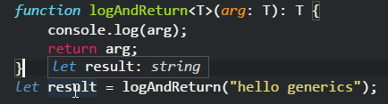
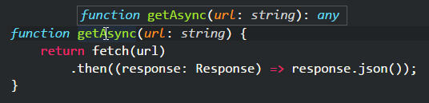
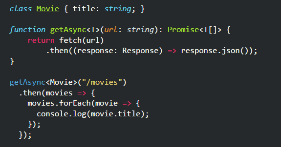
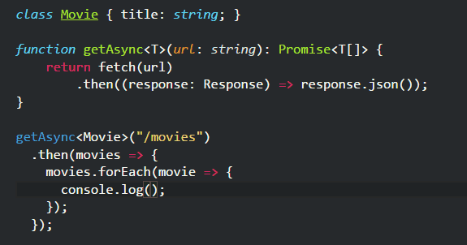
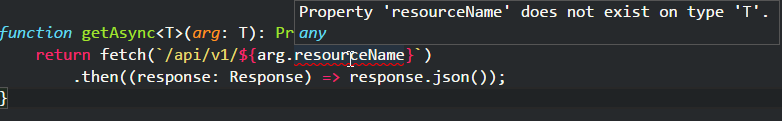
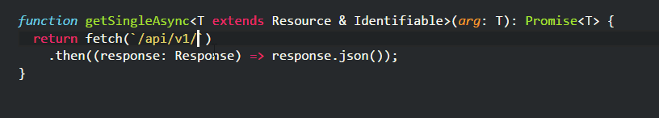

If you're new to TypeScript and have never worked with a language such as C#,
generics might be something strange to you.

But fear not, generics are not that complicated, and we're going to see in a few
examples, how does it work.

First of the syntax. To use generics in TypeScript when declaring a function we
have to say the function is generic. We do that with the following:

```js
function logAndReturn<T>(arg: T): T {
	console.log(arg);
	return arg;
}
var result = logAndReturn < string > "hello generics";
```

So, the function logAndReturn doesn't do anything useful but it shows us the
syntax of a generic function, and that is the T inside the angle brackets. The
way to read it is: logAndReturn expects a parameter of a type T and will return
a value of the same type T, where T can be anything, a string, a number, a
class, an object.

To call that function there are two ways; the first is demonstrated in the
example where we explicit say the type, in this case, a string and then, we pass
the value.

A second way is by using TypeScript's type inference.

```js
function logAndReturn<T>(arg: T): T {
	console.log(arg);
	return arg;
}
var result = logAndReturn("hello generics");
```

Note that we didn't specify the type, but because the function only expects one
argument and returns a value of the same type, the compiler knows that the
returned type is the same as the one passed to the function.



Big deal, you may say, so much work for that. OK, let's see another more useful
example.

Let's say we want to make an Ajax request and that we know that this Ajax
request will be returning a JSON that we can parse into an object or class. That
function may look like this:

```js
function getAsync(url: string) {
	return fetch(url).then((response: Response) => response.json());
}
```

Simple, I'm using the fetch API to make an async call using a Promise, and when
the call is completed, I'm calling the json function on the response.

At that point, the returned json could be anything as the compiler will tell you
by the type any being returned.



Now, that's a good generic function, if you're always making get calls and
expecting a json as a response. That's a good thing to have a function to do
that and not repeat it all over the place. You could even have a catch method
that would handle errors.

But one of the good things of TypeScript is having type checks, and also the
auto-complete when a type is known. And in this case, we could achieve that by
having a generic function.

```js
class Movie {
	title: string;
}

function getAsync<T>(url: string): Promise<T[]> {
	return fetch(url).then((response: Response) => response.json());
}

getAsync <
	Movie >
	"/movies".then(movies => {
		movies.forEach(movie => {
			console.log(movie.title);
		});
	});
```

In the above code I said that the function getASync will return a Promise, and
when that Promise is resolved it will contain an array of the type T.

When I call the function, I say that the type T is a Movie, based on the Movie
class.

When I mouse over the variables we can see, that the compiler is capable of
inferring the types of all variables used when calling the getAsync function.



Also, even though I didn't specify the type the movies and movie variables, I
have the auto-complete.



That's it, that's the basics of generics, if you got this, you have what it
takes to use it for most of the cases.

But generics can do even more. We can use constraints, and they're really cool.

Let's add just a little bit of complication on the example to show how that
works.

Let's say that when making get requests, will be calling an address with a
prefix '/api/v1/' and after that the name of the resource we're calling, in this
example, movies.

Instead of passing the URL to the function, I'm going pass the object, and that
object will contain the name of resource we need. (I know, there are other
alternatives as design, but I'm using this one to demonstrate the use of
generics).

What I want to do is this:

```js
function getAsync<T>(arg: T): Promise<T[]> {
	return fetch(`/api/v1/${arg.resourceName}`).then((response: Response) =>
		response.json(),
	);
}
```

If I do that, the compiler will complain that 'resourceName' does not exist in
type T.



That's obvious, the function can't know which type T will be and that it has the
properties we're expecting.

To achieve this, we have to use a constraint. I'm going to create an interface
Resource, and I'll say that the type T must implement that interface.

```js
interface Resource { resourceName: string; }

function getAsync<T extends Resource>(arg: T): Promise<T[]> {
    return fetch(`/api/v1/${arg.resourceName}`)
        .then((response: Response) => response.json());
}
```

See the _T extends Resource_? That's the way we tell the compiler the function
getAsync accepts any type T that implements the interface Resource.

Now if I change the Movie class to implement the interface Resource, I can call
the getAsync function again.

```js
class Movie implements Resource {
	title: string;
	resourceName: string = "movies";
}
getAsync <
	Movie >
	new Movie().then(movies => {
		movies.forEach(movie => {
			console.log(movie.title);
		});
	});
```

Or I could use type inference and don't specify the type explicitly.

```js
getAsync(new Movie()).then((movies) => {
	movies.forEach((movie) => {
		console.log(movie.title);
	});
});
```

Finally, one last example.

Let's say now that I want to write a function to make an Ajax call that will
return one instance of the resource I'm looking for based on its id property.

Something like this:

```js
function getSingleAsync<T extends Resource>(arg: T): Promise<T> {
  return fetch(`/api/v1/${arg.resourceName}/${arg.id}`)
    .then((response: Response) => response.json());
}
```

Again, the same problem, the compiler can't know if the type T has an id
property. We're going to solve this issue the same way as before, by creating
another interface and by telling to the generic function that the type T
implements both interfaces.

```js
class Movie implements Resource, Identifiable {
  title: string;
  resourceName: string = "movies";
  id: number;
}

function getSingleAsync<T extends Resource & Identifiable>(arg: T): Promise<T> {
  return fetch(`/api/v1/${arg.resourceName}/${arg.id}`)
    .then((response: Response) => response.json());
}

let movieToFind = new Movie();
movieToFind.id = 1;
getSingleAsync(movieToFind)
  .then(movie => {
    console.log(movie.title);
  });
```

See how that works? Now, I'm telling to the function that T implements Resource
and Identifiable. No more compiler errors, there's type checking and of course,
that gives is some more auto-complete goodness.



And that's it.
