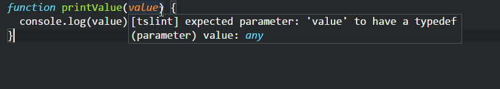
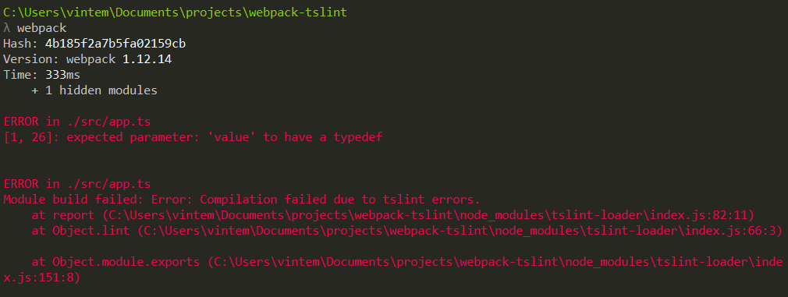

Linters are an excellent way to enforce some structure and to help avoid errors.
If you have never used a linter, you're missing on a set of great tools that
will assist your team to write better code.

There are tons of different linters for different languages. A famous one for
JavaScript is [eslint](http://eslint.org/), but there are lintes for
[CSS](http://csslint.net/), [SASS](https://github.com/brigade/scss-lint/), even
for [HTML](https://github.com/deezer/html-linter) and of course, the one I'll be
focusing today, for [TypeScript](https://palantir.github.io/tslint/).

TSLint, the linter for TypeScript has lots of different rules, and I'm not going
to talk about them, you can check the
[list of rules on their site](https://palantir.github.io/tslint/rules/), but
just to give you a taste, here are some things that the TSLint can check:

- if the code has semicolons
- if braces are used
- if you declare types on variables, functions, and parameters
- if there'are console statements left in the code
- indentation
- etc...

Most of text editors offer some integration with TSLint. For instance here's a
plugin for
[VSCode](https://marketplace.visualstudio.com/items?itemName=eg2.tslint),
[Sublime Text](https://packagecontrol.io/packages/SublimeLinter-contrib-tslint)
and [Atom](https://atom.io/packages/linter-tslint).

Integration with tools are great, because of the immediate feedback, here's an
example using VSCode.



TSLint has a set of default rules, but you can change them by creating a
tslint.json file in the root of your project. There's even an easy way to do
that. If you have
[installed tslint globally using npm](https://www.npmjs.com/package/tslint), you
just have to type the following command to have a tslint.json file created for
you.

```bash
tslint i
```

Then, it's just a matter of changing the file to something that your team agrees
with.

To be honest, I'm a linter addicted, if the linter is telling me to fix
something I'll do it. If I don't agree with the linter, I can change the rule.

But there may be moments when someone on the team can forget to check the
linter's warnings, so if you'd like, you could enforce those rules while
building the files.

I'm using [Webpack](https://webpack.github.io/) to build my files, but the same
results could be easily achieved by using other tools such as
[Gulp](http://gulpjs.com/) or [Grunt](http://gruntjs.com/).

When using Webpack, we use loaders to transform our files in some sort of way,
in the case of TypeScript there's a
[ts-loader](https://www.npmjs.com/package/ts-loader) to compile TypeScript
files.

In the same way, we use a loader to run our linter, so for TypeScript we use a
[tslint-loader](https://www.npmjs.com/package/tslint-loader).

The config is very simple:

```js
module.exports = {
	entry: "./src/app.ts",
	output: {
		filename: "build/bundle.js"
	},
	module: {
		preLoaders: [
			{
				test: /\.ts$/,
				loader: "tslint"
			}
		],
		loaders: [
			{
				test: /\.ts$/,
				loader: "ts"
			}
		]
	},
	tslint: {
		emitErrors: true,
		failOnHint: true
	}
};
```

In the module section, I added a preLoaders key that expects an array with all
the possible pre-loaders we'd like to use. In this case, I'm only using one.

There's also a tslint section where I'm saying that the linter should emit
errors, and the build should break in case of any errors.

Here's the result in the console:



And that's it for today.
