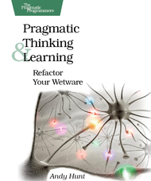

Some books are just so great that we want to spread the word about it even
before we finish reading it. This book is one of those.

Here's a piece of the summary of the book:

> In this book by Andy Hunt, you’ll learn how our brains are wired, and how to
> take advantage of your brain’s architecture. You’ll learn new tricks and tips
> to learn more, faster, and retain more of what you learn.

I can summarize my review of this book in a very short sentence. **I wish I have
read it before.**

Really the book provides various information about the functioning of our brain,
information that, at least for me, were new. Or was information that I had
obtained and had not retained ;). It is very interesting (and useful) the uses
analogies that the author makes to explain our brain making references to
computer architecture and asynchronous programming.

The book does not stay only in the theoretical part of the functioning of the
brain. It is very interesting to understand what is the Dreyfus model and the
stages we go through in obtaining knowledge. They are: beginner, advanced
beginner, competent, proficient and expert. Although I don't think people can be
categorized into levels, or better yet, only five levels, I think that is a good
form of feedback and a way to have parameters to guide us into how to achieve a
higher level of knowledge.

That people learn differently is already well publicized, but what I found
interesting about the ways we learn (related to the functioning of our brain),
was that the book sets out very clearly, and always using great metaphors, how
we can explore these differences with practical techniques.

One of these techniques is a way to define learning objectives called SMART
which stands for Specific, Measurable, Attainable, Relevant and Time-Bound.
Others include, always carry a small notebook, create a personal wiki, draw mind
maps, among others. Everything always with great theoretical basis.

Because I read a lot, I enjoyed the book very much and I'm already trying to put
things in practice. I hope you enjoy the hint and read the book, I liked it a
lot.
