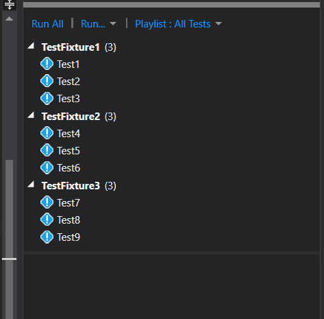
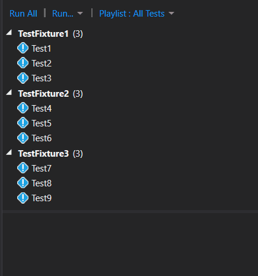
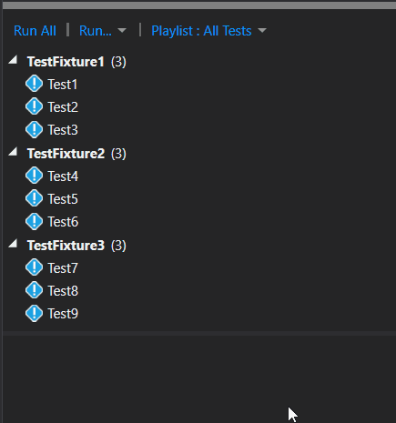

Since version 3 of NUnit, it is possible to run tests in parallel. And if you
can turn this feature on, you should. The implementation is simple, and you will
probably notice a considerable improvement in the time spent running the tests.

[According to the docs](https://github.com/nunit/docs/wiki/Parallelizable-Attribute),
there are three types of parallel execution to choose from:

- Self // the test itself may be run in parallel with other tests
- Children // child tests may be run in parallel with one another
- Fixtures // fixtures may be run in parallel with one another

## So how does that works?

First, let's see some tests running in series.



As you can see, at the bottom of the image, it took 13 seconds to run all tests.

All the tests in this demo are the same, and they are copies of this one:

```csharp
[Test]
public void Test1()
{
    System.Threading.Thread.Sleep(1000);
    Assert.IsTrue(true);
}
```

The simplest way to activate the parallel feature in NUnit is by doing so at an
assembly level.

Open your AssemblyInfo.cs file and add the following line:

```csharp
[assembly: Parallelizable(ParallelScope.Fixtures)]
```

The above line of code will make all fixture classes to run in parallel.

Here are the results:



[Ah! Much better](http://www.wavsource.com/snds_2016-02-14_1408938504723674/video_games/duke/better.wav),
half of the time and all the fixtures are running in parallel.

Now, let's say you have for some reason a class that cannot be tested in
parallel. Well, then you could use the ParallelScope.None on the particular
class or test.

In this example, I added the attribute to the TestFixure3 class.

```csharp
[TestFixture]
[Parallelizable(ParallelScope.None)]
public class TestFixture3
{
    // ...
}
```

And this is the result:



And that's it!
