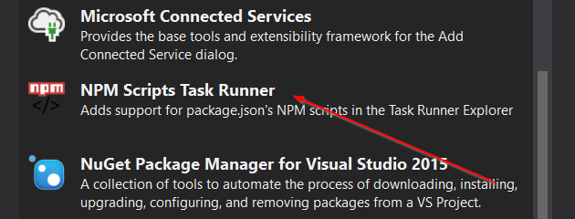
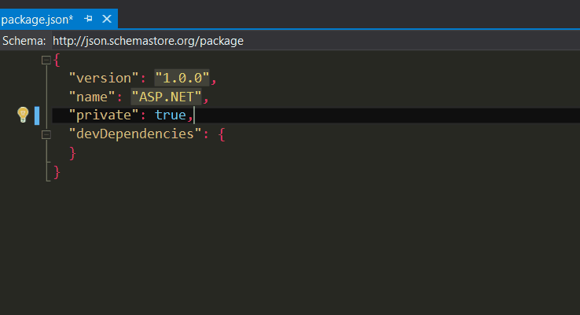
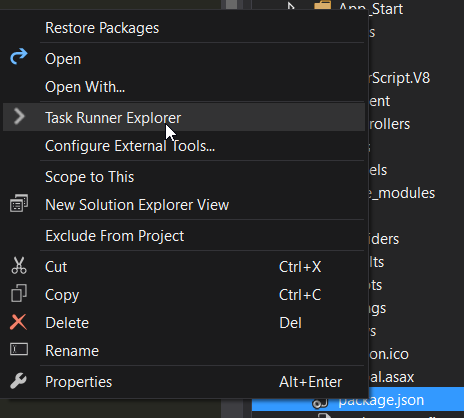
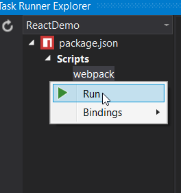
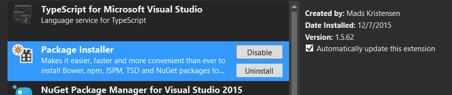
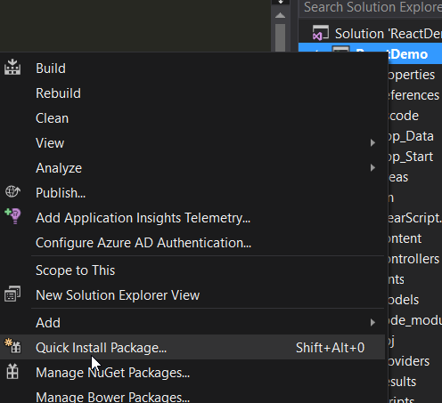
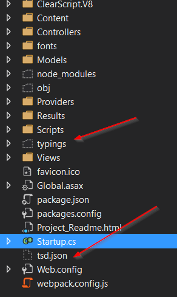

I work with Microsoft technologies in my day job. I do a lot of ASP.NET MVC
related stuff, and I wanted to use [React](https://facebook.github.io/react/)
with my [ASP.NET MVC](http://www.asp.net/mvc) application, but I wanted to have
a nice development experience. The same I have when using text editors such as
Sublime Text and other tools for Node.js.

I also wanted all that inside Visual Studio 2015, which is what I use at work.
Not because I have to live inside VS, but because I might have a teammate that
want to do so. So here's a description of what I've achieved so far using:

- Visual Studio 2015 Community Edition (the version I have at home, at work I
  use the Professional Edition)
- React
- Webpack
- Typescript
- TSD

First things first, I wanted it to work from Visual Studio because not everybody
using Visual Studio is comfortable or even likes to use a console. But in any
case, we have to have [Node.js](https://nodejs.org/en/) installed. That's an
easy thing to do so that I won't bother with the details of it.

Next, I have an ASP.NET MVC 5 project, using .NET 4.5. I know, ASP.NET 5 and MVC
6 are just around the corner, but that's not my reality yet and I bet it's not
the reality of many people.

So let's get into it.

We're going to install one extension that is called
[NPM Scripts Task Runner](https://visualstudiogallery.msdn.microsoft.com/8f2f2cbc-4da5-43ba-9de2-c9d08ade4941).
This extension will allow us to run an NPM task directly from Visual Studio.



## Node dependencies

With that in place, we have to install the node extensions we'll be using. First
I'll add a package.json file. When adding a new item to the web project, Visual
Studio has a template for adding a package.json file, we just have to search for
npm and add a new file.

First, I'm going to install react and react-dom. I'll add a dependencies section
to the package.json file and add both packages. Another nice thing of VS2015 is
that it has intellisense for adding node packages. And once the file is saved
the packages are automatically installed.



With that installed, I'm going to install the dependencies needed to use
[TypeScript](http://www.typescriptlang.org/) with
[Webpack](https://Webpack.github.io/).

Here's the result of my package.json file:

```json
{
	"version": "1.0.0",
	"name": "ASP.NET",
	"private": true,
	"dependencies": {
		"react": "0.14.3",
		"react-dom": "0.14.3"
	},
	"devDependencies": {
		"Webpack": "1.12.9",
		"ts-loader": "0.7.2",
		"typescript": "1.7.3"
	}
}
```

## Webpack

Time to configure Webpack. If you don't know Webpack, here's what it will do for
us: it will bundle all of our JavaScript or TypeScript files in a single file,
and will transpile the JSX and TypeScript syntax into JavaScript that the
browser will understand.

_Note:_ Webpack does a lot more than just that, but this post is not about
Webpack.

For that, we need a file called Webpack.config.js in the root of the project.
Here's mine:

```js
module.exports = {
	entry: "./Scripts/app/App.tsx",
	output: {
		filename: "Scripts/app/bundle.js"
	},
	resolve: {
		extensions: ["", ".Webpack.js", ".web.js", ".ts", ".js", ".tsx"]
	},
	module: {
		loaders: [
			{
				test: /\.tsx?$/,
				exclude: /(node_modules|bower_components)/,
				loader: "ts-loader"
			}
		]
	}
};
```

Here's what this file does:

- entry: it is, of course, the entry point of the application, in my case, the
  App.tsx file. If App.tsx depends on other files using _import_ statements,
  Webpack will bundle those files. I used a string here because I only had one
  file as an entry point. If you have more than one, you can use an array.
- output: the path and name of the file that will be generated. That's the file
  we have to reference in the HTML file.
- resolve: by default Webpack does no load .ts and .tsx files, we have to tell
  it to do so.
- module: here's where we set up the loader responsible for transpiling our
  code. In this case I'm using
  [ts-loader](https://www.npmjs.com/package/ts-loader) to transpile from
  TypeScript to JavaScript.

Now, all that is left to do is to find a way to transpile automatically the tsx
files and refresh the page in the browser.

## Watch and recompile files

Running the command webpack -w from a console Webpack will launch compile the
files and bundle them. The -w option stands for watch meaning that Webpack will
watch for changes in my files recompile and rebundle them.

So all I have to do is launch this command from Visual Studio. The way I choose
to do that is via an npm command. I'm going to add a script command in the
package.json file and launch it from VS2015.

Here's the package.json modified, notice the scripts section:

```json
{
	"version": "1.0.0",
	"name": "ASP.NET",
	"private": true,
	"scripts": {
		"webpack": "webpack -w"
	},
	"dependencies": {
		"react": "0.14.3",
		"react-dom": "0.14.3"
	},
	"devDependencies": {
		"Webpack": "1.12.9",
		"ts-loader": "0.7.2",
		"typescript": "1.7.3"
	}
}
```

I added a script called webpack that will run the command webpack -w.

Now, if I right-click the package.json file there will be an option called Task
Runner, click that and you'll see the Task Runner Explorer window.



From the Task Runner Explorer window, you can right-click the webpack task and
click run.



That will start Webpack and because of the -w option, the tsx files will be
automatically compiled whenever they're changed.

## TypeScript and typings

Because TypeScript is a typed language, it needs the types of the packages we're
using. One way to add the typings for those packages is through nuget.
Personally, I prefer to another tool to do that which is
[TSD](https://github.com/Definitelytyped/tsd).

One would use [tsd](https://github.com/Definitelytyped/tsd) via the console, but
because my goal here is not to leave Visual Studio, I'll be using another VS
extension to add the typings using tsd.

The extension I'm going to install is
[Package Installer](https://visualstudiogallery.msdn.microsoft.com/753b9720-1638-4f9a-ad8d-2c45a410fd74).



With that in place, in the Solution Explorer window, I can right-click the
project name and click on Quick Install Package.



Now, I just have to install the React typings. I'll start by selecting TSD on
the first option, and then I'll type react-global and I'll leave latest-version
as the version I want.

The first time we do that a typings folder and a tsd.json file will be created.
We have to include them in the project as this is not done automatically.



That's all there is to it regarding the typings for TypeScript.

_Note:_ I don't know if there's a bug on VS2015, but I had to close the project
and reopen it for the changes to take effect.

## Refreshing the page

Visual Studio does not refresh the page automatically when a JavaScript file
changes. It only does refreshes portions of the page through the use of
BrowserSync when some CSS or styles are changed.

In any case, Visual Studio does support the command **Ctrl + Alt + Enter** that
will refresh the page, in all browser's that are connected to Visual Studio
through BrowserSync.

And then the cycle is complete. We can now make changes to the
JavaScript/TypeScript code, and the code will be recompiled, and we can refresh
the page without ever taking our hands off the keyboard.
