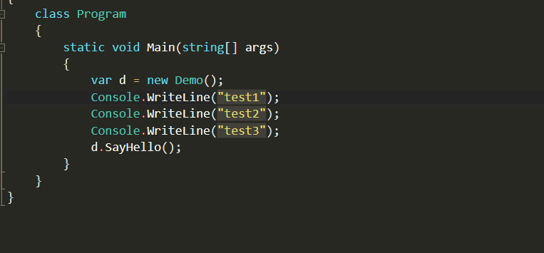
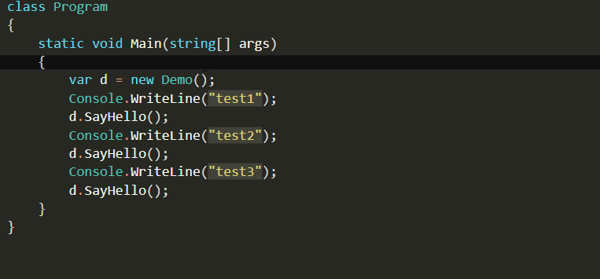
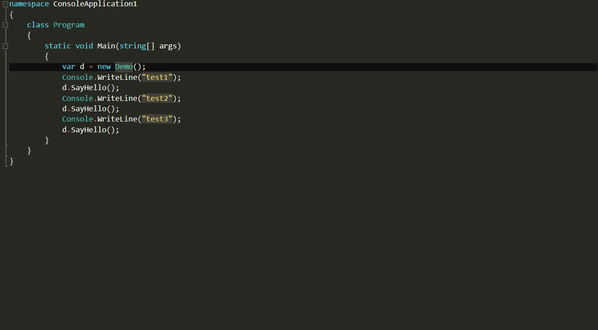
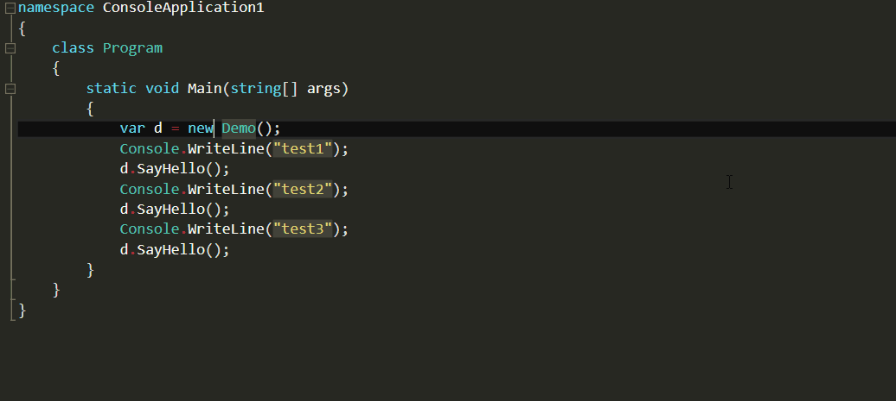
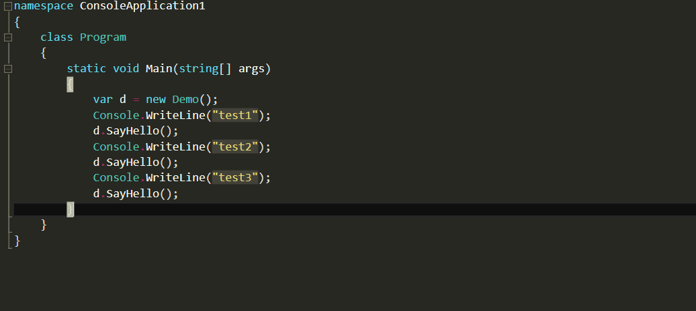

I don't know about you, but when I'm coding, I like to keep my hands on the
keyboard. I find that reaching for the mouse is disrupting and breaks the flow.

So I like my shortcuts. I don't know all of them, but I know plenty and I'm
always eager to memorize new ones.

For most of the time, I'm on Visual Studio, and there's a
[great site](http://visualstudioshortcuts.com/2015/) if you want to find out
some useful shortcuts.

Of course, if you have something like Resharper your shortcuts can be further
improved.

But here are five great ones that I'd like to share:

## Surround with: Ctrl+K,Ctrl+S

If you want to surround your code with, an if, a region, or any kind of loop
this is a great one. Select the line(s) of code, type Ctrl+K, Ctrl+S and choose
what you want to surround your code with.

## Next/Previews Highlighted Reference: Ctrl+Shift+Down Arrow/Ctrl+Shift+Up Arrow

You know when you position the cursor on a variable name or function name and
Visual Studio highlights them? You can easily navigate through those references
with this shortcuts.

## Peek Definition: Alt+F12

Just want to check rapidly what a method or class do? Use the peek definition.
To get back to your code just press Esc.

## Quick Info: Ctrl+K, Ctrl+I

Another way to see the information on a method or class is to use the Quick info
shortcut.

## Line Delete: Ctrl+Shift+L

Want to delete a line? Just position the cursor on the desired line and hit
Ctrl+Shift+L. No need to select the line.

Visual Studio has lots of shortcuts by default, and the best resource I found to
learn them is the
[Visual Studio keyboard shortcuts site](http://visualstudioshortcuts.com/2015/).
